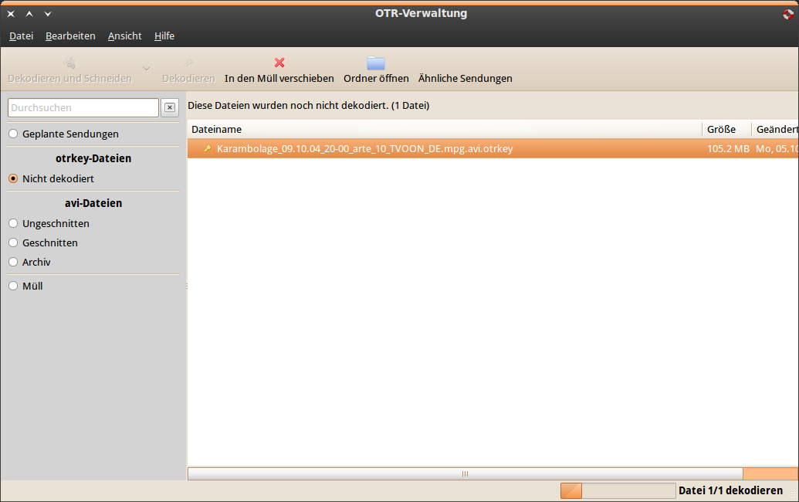
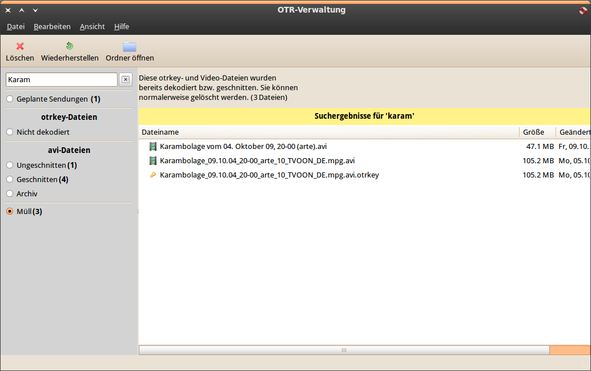
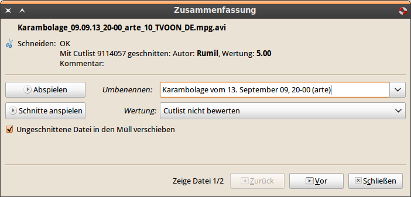

OTR-Verwaltung
==============

Mit OTR-Verwaltung lassen sich otrkey- und avi-Dateien von `onlinetvrecorder.com <http://www.onlinetvrecorder.com>`_ unter Linux verwalten.

* otrkey-Dateien dekodieren
* avi-Dateien mit Cutlists schneiden (Avidemux und VirtualDub)
* mehrere Dateien gleichzeitig verarbeiten
* Cutlists nach dem Schneiden bewerten
* Cutlists mit Avidemux oder VirtualDub selbst erstellen und hochladen
* Schnitte vorher mit dem MPlayer betrachten

   

Downloads
#########

**Aktuelle deb-Datei** (z.B. für Ubuntu, Debian): `Download <http://cloud.github.com/downloads/elbersb/otr-verwaltung/otrverwaltung_0.8.3_all.deb>`_ (für GTK 2.16)

**Aktuelle rpm-Datei** (z.B. für Fedora): `Download <http://cloud.github.com/downloads/elbersb/otr-verwaltung/otrverwaltung-0.8.3-2.noarch.rpm>`_ (für GTK 2.16)

`Weitere Downloads <http://github.com/elbersb/otr-verwaltung/downloads>`_

Hilfe für Benutzer
##################

Es kann sich auch gerne in `diesem Thread im OTR-Forum <http://www.otrforum.com/showthread.php?t=53400>`_ beteiligt werden!

.. toctree::
    :maxdepth: 2    
  
    user/start
    user/faq

Plugins von Usern
#################

Die Plugins müssen im versteckten Ordner ``.otr-verwaltung/plugins`` im Homeverzeichnis abgelegt werden. Sie können dann im Plugins-Menü von OTR-Verwaltung aktiviert werden.

* **Ordner öffnen** von antion - Durch einen Klick wird der Ordner geöffnet, in dem sich die Datei befindet
    :download:`Download <_downloads/openFolder.py>` (1,6kb)

Hilfe für Entwickler
####################

Das Repository befindet sich auf Github: http://github.com/elbersb/otr-verwaltung

.. toctree::
    :maxdepth: 2    
    
    developer/contribute
    developer/pluginproposals
    developer/create_plugin
    developer/api

Dank an
#######

* alle, die sich im Thread beteiligt haben und noch beteiligen!
* onlinetvrecorder.com für den Code für die GUI des Decoders
* siggi und bowmore aus dem otrforum für verschiedenen Code aus ihren Scripten
* die Autoren von Multicut-Light für Ideen und Code (Otr-Forum-Thread)
* für die tollen famfam-Icons: http://www.famfamfam.com/lab/icons/silk/
* das Icon stammt von Oliver Twardowski 
* Hosting: Dank an `Github <http://github.com>`_ und `000webhost <http://www.000webhost.com>`_

Referenzen
==========

* :ref:`genindex`
* :ref:`search`
